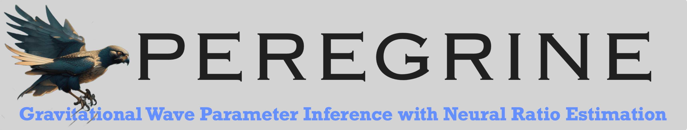
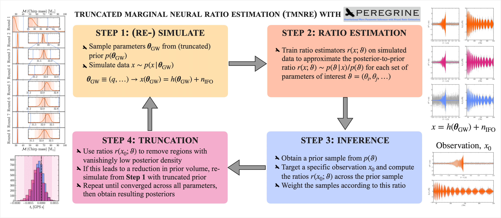

[](https://github.com/PEREGRINE-GW/peregrine) [](https://arxiv.org/abs/2304.02035)
## Description

- **PEREGRINE** is a Simulation-based Inference (SBI) library designed to perform analysis on a wide class of gravitational wave signals. It is built on top of the [swyft](https://swyft.readthedocs.io/en/) code, which implements neural ratio estimation to efficiently access marginal posteriors for all parameters of interest.
- **Related paper:** The details regarding the implementation of the TMNRE algorithm and the specific demonstration for compact binary black hole mergers can be found in [arxiv:2304.02035](https://arxiv.org/abs/2304.02035).
- **Key benefits:** We showed in the above paper that PEREGRINE is extremely sample efficient compared to traditional methods - e.g. for a BBH merger, we required only 2% of the waveform evaluations than common samplers such as dynesty. The method is also an 'implicit likelihood' technique, so it inherits all the associated advantages such as the fact that it does not require an explicit likelihood to be written down. This opens up the possibility of using PEREGRINE to analyse a wide range of transient or continuous gravitational wave sources.
- **Contacts:** For questions and comments on the code, please contact either [Uddipta Bhardwaj](mailto:u.bhardwaj@uva.nl) or [James Alvey](mailto:j.b.g.alvey@uva.nl). Alternatively feel free to open an issue.
- **Citation:** If you use PEREGRINE in your analysis, or find it useful, we would ask that you please use the following citation.
```
@article{Bhardwaj:2023xph,
    author = "Bhardwaj, Uddipta and Alvey, James and Miller, Benjamin Kurt and Nissanke, Samaya and Weniger, Christoph",
    title = "{Peregrine: Sequential simulation-based inference for gravitational wave signals}",
    eprint = "2304.02035",
    archivePrefix = "arXiv",
    primaryClass = "gr-qc",
    month = "4",
    year = "2023"
}
```

## Recommended Installation Instructions

### Environment Setup
The safest way to install the dependencies for `peregrine` is to create a virtual environment from `python>=3.8`

**Option 1 (venv):**
```
python3 -m venv /your/choice/of/env/path/
```
- Source the new environment
```
source /your/choice/of/env/path/bin/activate
```

**Option 2 (conda):**
```
conda create -n your_env_name python=3.x (python>=3.8 required)
conda activate your_env_name
```

### Code Installation
- Clone the peregrine repo into location of choice
```
cd /path/to/your/code/store/
git clone git@github.com:PEREGRINE-GW/peregrine.git
```
- Install the relevant packages including e.g. `swyft` and GW specific analysis tools
```
pip install git+https://github.com/undark-lab/swyft.git
pip install tensorboard psutil gwpy lalsuite bilby
```

## Running peregrine



Key run files:
- `generate_observation.py` - Generates a test observation from a configuration file given a set of injection parameters
- `tmnre.py` - Runs the TMNRE algorithm given the parameters in the specified configuration file
- `coverage.py` - Runs coverage tests on the logratio estimators that have been generated by `tmnre.py`

Example Run Scheme:
- Step 1: Generate a configuration file following the instructions in the [examples directory](./examples/config_files). To just do a test run, you will only need to change the `store_path` and `obs_path` options to point to the desired location in which you want to save your data.
- Step 2: Change directory to `peregrine/peregrine` where the run scripts are stored
- Step 3: Generate an observation using `python generate_observation.py /path/to/config/file.txt` or point to a desired observation in the configuration file
- Step 4: Run the inference algorithm using `python tmnre.py /path/to/config/file.txt`, this will produce a results directory as described below
- Step 5: (optional): Run the coverage tests using `python coverage.py /path/to/config/file.txt n_coverage_samples` (`n_coverage_samples = 2000` is usually a good start)

Result output:
- `config_[run_id].txt` - copy of the config file used to generate the run
- `bounds_[run_id]_R[k].txt` - bounds on the individual parameters from Round `k` of the algorithm
- `coverage_[run_id]/` - directory containing the coverage samples if `coverage.py` has been run
- `logratios_[run_id]/` - directory containing the logratios and samples for each round of inference (stored in files `logratios_R[k]` for each round `k`. These can be loaded using the `pickle` python library)
- `observation_[run_id]` - `pickle` file containing the observation used for this run as a `swyft.Sample` object. The same observation is used for both the TMNRE algorithm and any traditional sampling approach.
- `param_idxs_[run_id].txt` - A list of parameter IDs that can be matched to the logratios results files and used for plotting purposes.
- `simulations_[run_id]_R[k]/` - `Zarrstore` directory containing the simulations for Round `k` of inference
- `trainer_[run_id]_R[k]/` - directory containing the information and checkpoints for Round `k` of training the inference network. This directory can also be passed to `tensorboard` as `tensorboard --logdir trainer_[run_id]_R[k]` to investigate the training and validation performance.
- `log_[run_id].log` - Log file containing timing details of run and any errors that were raised

## Available Branches:
- `cbc` - analysis for 2G detector single GWs is implemented [THIS BRANCH]
- `overlapping` - analysis for multiple GWs in a 2G detector

## Release Details:
- v0.0.1 | *August 2023* | Public PEREGRINE release matching companion paper: 
    - [Peregrine: Sequential simulation based inference for gravitational waves](https://arxiv.org/abs/2304.02035)
